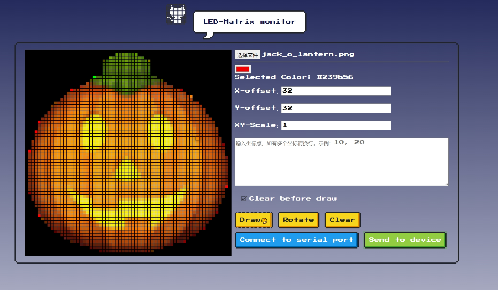
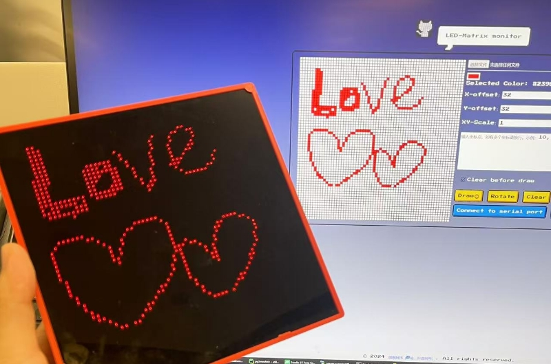

# esp32draw
Draw pictures on LED matrix screen witch powered by ESP32 dev board.  

  

### step1  
Install firmware on your ESP32 board.  
You can build and upload the firmware with Arduino IDE.   

### step2  
Install cp2012 driver for serial communication.  
Download from [here](https://www.silabs.com/developer-tools/usb-to-uart-bridge-vcp-drivers?tab=downloads)  

### step3  
Connect your device to computer and open [this page](https://makerawei-1251006064.cos.ap-guangzhou.myqcloud.com/esp32draw/index.html)  
Then you can `connect to serial port` and draw something, then you can send your image with the `Send to device` button  

